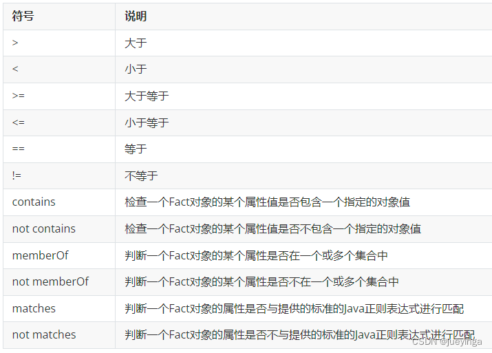
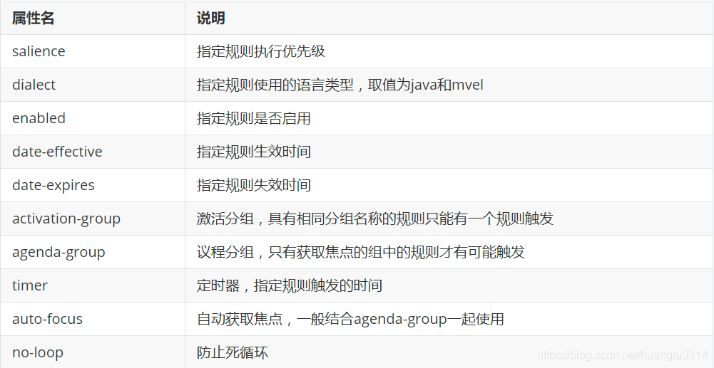

#Drools
```aidl
*无需改代码，动态热部署
*代码逻辑更清楚
*用于计算各种规则
*规则存储于数据库，缓存在redis，避免磁盘读取，提高效率
```
## 基本语法介绍
```aidl
rule "ruleName"
    attributes
    when
        LHS
    then
        RHS
end
    
rule: 关键字， 规则开始，参数为说明该规则的名称
attributes： 中间的规则属性内容
when： 对，就是和你想的一样，判断条件
LHS：左手规则，也就是条件，如果没有设置，默认为true
then：不要暂停你的想象，你想的是对的，满足条件之后的处理方式
RHS：结果
end：规则结束
```

###LHS
* 语法结构为：变量名：Object
```aidl
变量名以$开头，定义了变量名，后续可以直接通过变量名来操作对象
案例：
    
    // 规则一：所购图书总价在100到200元的优惠20元
    rule "order_discount_1"
        when
            // Order为类型约束即Fact对象，originalPrice为Order里的属性约束
            $order:Order(originalPrice < 200 && originalPrice >= 100)
        then
            $order.setRealPrice($order.getOriginalPrice() - 20);
            System.out.println("成功匹配到规则二：所购图书总价在100到200元的优惠20元");
    end
    解释：
    匹配的条件为：
        1、工作内存中必须存在Order这种类型的Fact对象-----类型约束
        
        2、Fact对象的originalPrice属性值必须小于200------属性约束
        
        3、Fact对象的originalPrice属性值必须大于等于100------属性约束
        
        以上条件必须同时满足当前规则才有可能被激活。
        
    // 规则二，多条件情况下
    rule "order_discount_2"
        when
            $order:Order($op:originalPrice < 200 && originalPrice >= 100) and
            $customer:Customer(age > 20 && gender=='male')
        then
            System.out.println("$op=" + $op);
            $order.setRealPrice($order.getOriginalPrice() - 20);
            System.out.println("成功匹配到规则二：所购图书总价在100到200元的优惠20元");
    end
```
* 比较操作符


* 关键字

```aidl
package: 这个不知道我也没辙
import: 这个不知道我也没辙
global: 全局变量
function：自定义函数
no-loop：结束循环
lock-on-active： 一般和no-loop一起使用
date-effective：规则激活日期
date-expires：规则失效日期

```
* 定时任务
  timer属性
```aidl
package testtimer
import java.text.SimpleDateFormat
import java.util.Date
/*
    此规则文件用于测试timer属性
*/
rule "rule_timer_1"
    timer (5s 2s) //含义：5秒后触发，然后每隔2秒触发一次
    when
    then
        System.out.println("规则rule_timer_1触发，触发时间为：" + 
                         new SimpleDateFormat("yyyy-MM-dd HH:mm:ss").format(new Date()));
end

rule "rule_timer_2"
    timer (cron:0/1 * * * * ?) //含义：每隔1秒触发一次
    when
    then
        System.out.println("规则rule_timer_2触发，触发时间为：" + 
                         new SimpleDateFormat("yyyy-MM-dd HH:mm:ss").format(new Date()));
end
// 启动规则引擎进行规则匹配，直到调用halt方法才结束规则引擎
kieSession.fireUntilHalt();
```
* 言尽于此，其他的就慢慢摸索

## 优惠券和规则约束
* 优惠券创建需要选择对应的规则，而每一个规则均来自于规则服务，其中数据关系为：规则列表，规则列结果表，